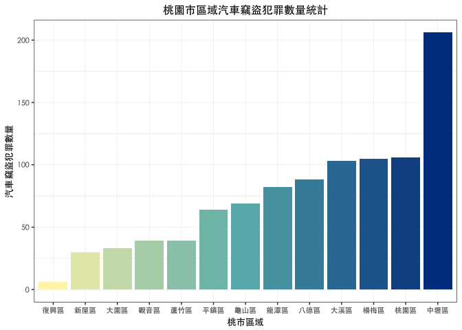

報告主題：居安思維
================

組員姓名：游思亭

資料介紹
--------

### 1. 犯罪資料

來源：<http://data.gov.tw/node/14200>

格式：.CSV

資料描述：提供毒品、強盜、搶奪、住宅盜竊、汽車竊盜、機車竊盜、強制性交等7案類犯罪發生資料。

欄位：案類、發生日期、發生地點（鄉、鎮、市、區）

### 2. 桃園市狹小巷弄列管清冊

#### 來源：<http://data.tycg.gov.tw/opendata/datalist/datasetMeta?oid=65c58683-220f-4075-a555-f80c7e580e5e>

#### 格式：.CSV

#### 資料描述：桃園市政府消防局搶救不易地區-狹小巷弄列管清冊，總計392處

#### 欄位：序號、行政區、狹小巷弄地址

分析議題
--------

### 1. 背景 :

禮運大同篇：「....是故謀閉而不興，盜竊亂賊而不作，故外戶而不閉，是謂『大同』。」在每個人心

中都有個小烏托邦。然而，近幾年來卻發生了許多社會事件，導致普羅大眾人心惶惶。

### 2. 動機 :

從古至今人們即在追求居安的生活品質，不論老少都需要一個安全穩定居住品質。因此，想要了解桃園

市的優質居住區域，藉由犯罪資料來分析出較適合的居住空間。

### 3. 假設：

每個人都是桃園人，每個人都想在桃園地區找到較安全的行政區來居住。並參考桃園市自變更為直轄市

後的分區發展願景 (出處：<https://www.moneydj.com/Topics/taoyuan/>)。

載入使用資料們

``` r
#這是R Code Chunk
# 載入犯罪資料
library(readr)
cridata0103 <- read_csv("~/Desktop/105犯罪資料/10501-10503criminaldata.csv.xls")
```

    ## Warning: Missing column names filled in: 'X4' [4]

    ## Parsed with column specification:
    ## cols(
    ##   案類 = col_character(),
    ##   發生日期 = col_integer(),
    ##   發生地點 = col_character(),
    ##   X4 = col_character()
    ## )

``` r
cridata0406 <- read_csv("~/Desktop/105犯罪資料/10504-10506criminaldata.csv.xls")
```

    ## Warning: Missing column names filled in: 'X4' [4]

    ## Parsed with column specification:
    ## cols(
    ##   案類 = col_character(),
    ##   發生日期 = col_integer(),
    ##   發生地點 = col_character(),
    ##   X4 = col_character()
    ## )

``` r
cridata0709 <- read_csv("~/Desktop/105犯罪資料/10507-10509criminaldata.csv.xls")
```

    ## Warning: Missing column names filled in: 'X4' [4]

    ## Parsed with column specification:
    ## cols(
    ##   案類 = col_character(),
    ##   發生日期 = col_integer(),
    ##   發生地點 = col_character(),
    ##   X4 = col_character()
    ## )

``` r
cridata1012 <- read_csv("~/Desktop/105犯罪資料/10510-10512criminaldata.csv.xls")
```

    ## Warning: Missing column names filled in: 'X4' [4]

    ## Parsed with column specification:
    ## cols(
    ##   案類 = col_character(),
    ##   發生日期 = col_integer(),
    ##   發生地點 = col_character(),
    ##   X4 = col_character()
    ## )

``` r
# 載入狹小巷弄（潛在危險）
narrowalley <- read_csv("~/Desktop/潛在危險/NarrowAlleyTY.csv")
```

    ## Parsed with column specification:
    ## cols(
    ##   行政區 = col_character(),
    ##   狹小巷弄地址 = col_character()
    ## )

資料處理與清洗
--------------

・105年犯罪資料 cridata0112\_ty

讀取下的105年犯罪資料以每季作為區隔，且為全台犯罪紀錄資料。先將每季犯罪資料合併，刪除多於欄位X4，並將欄位名稱重新命名，以防字元錯誤的問題發生。篩選出桃園市犯罪資料，檢查發生地點欄位值的內容發現有“桃園市”及“桃園市桃園區”的存在，兩者應為同一欄位內容，為保留“桃園市桃園區”，因此先判斷欄位值是否為“桃園市”，並新增欄位index，最後將欄位值為“桃園市”的資料改為“桃園市桃園區”。

step1. 將合併每季犯罪資料

step2. 將犯罪資料第四欄位X4去除

step3. 更改cridata0112\_tw欄位名稱: Type, Date, Site

step4. 將桃園市所有犯罪資料篩選出

step5. 將cridata0112\_ty的發生地點“桃園市”改為“桃園市桃園區”

・狹小巷弄資料 narrowalley\_ty

備份狹小巷弄資料narrowalley\_ty，並將欄位名稱重新命名，以防字元錯誤的問題發生。

step1. 將narrowalley備份

step2. 更改narrowalley\_ty欄位名稱: Site, Address

處理資料

``` r
# （一）讀取下的105年犯罪資料以每季作為區隔，為全台犯罪紀錄資料。
# 每季犯罪資料前三筆
knitr::kable(head(cridata0103,3))
```

| 案類     | 發生日期 | 發生地點     | X4  |
|:---------|:--------:|:-------------|:----|
| 住宅竊盜 |  1050101 | 基隆市中山區 | NA  |
| 住宅竊盜 |  1050101 | 新北市土城區 | NA  |
| 住宅竊盜 |  1050101 | 新北市新莊區 | NA  |

``` r
knitr::kable(head(cridata0406,3))
```

| 案類     | 發生日期 | 發生地點     | X4  |
|:---------|:--------:|:-------------|:----|
| 住宅竊盜 |  1050401 | 雲林縣西螺鎮 | NA  |
| 住宅竊盜 |  1050401 | 桃園市楊梅區 | NA  |
| 住宅竊盜 |  1050401 | 台南市新化區 | NA  |

``` r
knitr::kable(head(cridata0709,3))
```

| 案類     | 發生日期 | 發生地點     | X4  |
|:---------|:--------:|:-------------|:----|
| 住宅竊盜 |  1050701 | 桃園市八德區 | NA  |
| 住宅竊盜 |  1050701 | 桃園市中壢區 | NA  |
| 住宅竊盜 |  1050701 | 新北市新莊區 | NA  |

``` r
knitr::kable(head(cridata1012,3))
```

| 案類     | 發生日期 | 發生地點     | X4  |
|:---------|:--------:|:-------------|:----|
| 住宅竊盜 |  1051001 | 台南市中西區 | NA  |
| 住宅竊盜 |  1051001 | 台南市白河區 | NA  |
| 住宅竊盜 |  1051001 | 台北市中正區 | NA  |

``` r
# 狹小巷弄資料前三筆
knitr::kable(head(narrowalley,3))
```

| 行政區 | 狹小巷弄地址      |
|:-------|:------------------|
| 桃園區 | 桃園區民安路122巷 |
| 桃園區 | 桃園區民安路128巷 |
| 桃園區 | 桃園區民安路136巷 |

``` r
# （二）觀察資料去除多餘或不全並做整理
# 1. 105年犯罪資料
# 先將每季犯罪資料合併，刪除多於欄位，並將欄位名稱重新命名，以防字元錯誤的問題發生。
# <作法>
# 合併每季犯罪資料 
# cridata0112
cridata0112 <- rbind(cridata0103,cridata0406,cridata0709,cridata1012)
# 刪除第四欄位: X4
# cridata0112_tw
cridata0112_tw <- cridata0112[-4]
# 更改欄位名稱: Type, Date, Site
names(cridata0112_tw) <- c("Type","Date","Site")

# 篩選出桃園市犯罪資料，檢查發生地點欄位值的內容發現有“桃園市”及“桃園市桃園區”的存在，兩者應為同一欄位內容，保留“桃園市桃園區”。
# <作法>
# 將桃園市所有犯罪資料篩選出
# cridata0112_ty
cridata0112_ty <- cridata0112_tw[grep("桃園市",cridata0112_tw$Site),]
# 將發生地點為“桃園市”的資料篩選出 
# cridata0112_ty_T
 # 找出完全符合的欄位值,回傳Ｔ＆Ｆ
cridata0112_ty_T <- data.frame(cridata0112_ty$Site %in% "桃園市")
 # 更改欄位名稱: C
names(cridata0112_ty_T) <- "C"
 # 新增欄位名稱: index,新增欄位值: 1:8693
cridata0112_ty_T$index <- 1:8693
 # 將欄位Ｃ的值改為字串型態
cridata0112_ty_T$C <- as.character(cridata0112_ty_T$C)
 # 將欄位Ｃ的值改為"TRUE"的資料篩選出
cridata0112_ty_T <- cridata0112_ty_T[grep("TRUE",cridata0112_ty_T$C),]
# 將“桃園市”改為“桃園市桃園區” 
# cridata0112_ty
cridata0112_ty$Site[cridata0112_ty_T$index] <- "桃園市桃園區"
# 105年桃園市犯罪資料前三筆
knitr::kable(head(cridata0112_ty,3))
```

| Type     |     Date| Site         |
|:---------|--------:|:-------------|
| 住宅竊盜 |  1050105| 桃園市八德區 |
| 住宅竊盜 |  1050105| 桃園市中壢區 |
| 住宅竊盜 |  1050106| 桃園市大園區 |

``` r
# 2. 狹小巷弄資料
# 更改欄位名稱: Site, Address
# narrowalley_ty
narrowalley_ty <- narrowalley
# 更改欄位名稱: Site, Address
names(narrowalley_ty) <- c("Site","Address")
# 狹小巷弄資料前三筆
knitr::kable(head(narrowalley_ty,3))
```

| Site   | Address           |
|:-------|:------------------|
| 桃園區 | 桃園區民安路122巷 |
| 桃園區 | 桃園區民安路128巷 |
| 桃園區 | 桃園區民安路136巷 |

分析結果
--------

根據資料分析出的數據顯示，在桃園地區南北縱向的政經科教的區域較沒有表面

上看起來的生活安全，雖然是桃園市的政治中心地帶，有可能也因為人多混雜，

人口流動頻繁，又都市區域劃分為多種用途，導致成為“大雜會”都心，反而在東

西橫向的行政區犯罪情形較沒那麼多，可能居住民眾較淳樸、人口流動較平緩等

因素，使得犯罪的機率與潛在危險的狹小巷弄相對少些。

因此，最後建議不太要求生活機能的卻因安全因素的考量的你們，可以考慮東西

橫向的行政區來居住喔。

另外，東西橫向的區域的發展核心偏向觀光、航空、港口，選擇這些地區感覺也

不錯還可以觀看海岸線，體驗民俗文化等，陶冶一下性情！

``` r
# 1. 105年犯罪資料
# 統計桃園各案類犯罪資料
# cridata0112_ty_type
cridata0112_ty_type <- data.frame(table(cridata0112_ty$Type))
# 更改欄位名稱: Type, Quantity
names(cridata0112_ty_type) <- c("Type","Quantity")
# 備份 cridata0112_ty_type0
cridata0112_ty_type0 <- cridata0112_ty_type
# 更改欄位名稱: "犯罪案類", "案類數量"
names(cridata0112_ty_type) <- c("犯罪案類","案類數量")
# 長條圖
library("RColorBrewer")
library(ggplot2)
ggplot() +
  geom_bar(data=cridata0112_ty_type0,
           aes(x = reorder(Type,Quantity), y = Quantity),
           fill =  brewer.pal(7, "YlGnBu")[cridata0112_ty_type0$Type],
           stat = "identity") + 
  ggtitle("桃園市犯罪案類數量統計") + 
  xlab("犯罪案類") + ylab("案類數量") +
  theme_bw() + 
  theme(text = element_text(family="黑體-繁 中黑", size=10),
        panel.border = element_rect(colour = "#323232"),
        panel.grid = element_line(colour = "#F5F5F5",size = 0.2),
        plot.title = element_text(hjust = 0.5))
```


``` r
# 從上圖可以看出桃園市犯罪案件類型最高的為毒品
# 由大到小排序
cridata0112_ty_type <- cridata0112_ty_type[order(cridata0112_ty_type$案類數量,decreasing = TRUE),]
# 更改列名: 1~7
rownames(cridata0112_ty_type) <- c(1:7)
# 犯罪類型最高統計
knitr::kable(cridata0112_ty_type)
```

| 犯罪案類 | 案類數量 |
|:---------|:--------:|
| 毒品     |   4823   |
| 機車竊盜 |   2688   |
| 汽車竊盜 |    970   |
| 住宅竊盜 |    146   |
| 強盜     |    28    |
| 搶奪     |    22    |
| 強制性交 |    16    |

``` r
# 將毒品資料找出
tyDS <- cridata0112_ty[grep("毒品",cridata0112_ty$Type),]
# 統計個行政區毒品犯罪數量
tyDSTotal <- data.frame(table(tyDS$Site))
# 更改欄位名稱
colnames(tyDSTotal) <- c("桃園市行政區","毒品犯罪數量")
# 將“桃園市”取代為“”
tyDSTotal$桃園市行政區 <- sub("桃園市","",tyDSTotal$桃園市行政區)
# 長條圖
library(ggplot2)
ggplot(data=tyDSTotal) + 
  geom_bar(aes(x = reorder(桃園市行政區,毒品犯罪數量), y = 毒品犯罪數量),
           fill=colorRampPalette(c("#fff3b8","#67b5b7", "#003f8e"))(13),
           stat = "identity") + 
  ggtitle("桃園市區域毒品犯罪數量統計") + 
  xlab("桃市區域") + ylab("毒品犯罪數量") +
  theme_bw() + 
  theme(text = element_text(family="黑體-繁 中黑", size=10),
        panel.border = element_rect(colour = "#323232"),
        panel.grid = element_line(colour = "#F5F5F5",size = 0.2),
        plot.title = element_text(hjust = 0.5))
```


``` r
# 由大到小排序
tyDSTotal <- tyDSTotal[order(tyDSTotal$毒品犯罪數量,decreasing = TRUE),]
# 更改列名: 1~13
rownames(tyDSTotal) <- c(1:13)
knitr::kable(tyDSTotal)
```

| 桃園市行政區 | 毒品犯罪數量 |
|:-------------|:------------:|
| 桃園區       |     1350     |
| 中壢區       |     1114     |
| 八德區       |      488     |
| 平鎮區       |      446     |
| 龜山區       |      372     |
| 龍潭區       |      210     |
| 大溪區       |      204     |
| 蘆竹區       |      167     |
| 楊梅區       |      167     |
| 大園區       |      140     |
| 觀音區       |      94      |
| 新屋區       |      59      |
| 復興區       |      12      |

``` r
# 將機車竊盜資料找出
tyMT <- cridata0112_ty[grep("機車竊盜",cridata0112_ty$Type),]
# 統計個行政區毒品犯罪數量
tyMTTotal <- data.frame(table(tyMT$Site))
# 更改欄位名稱
colnames(tyMTTotal) <- c("桃園市行政區","機車竊盜犯罪數量")
# 將“桃園市”取代為“”
tyMTTotal$桃園市行政區 <- sub("桃園市","",tyMTTotal$桃園市行政區)
# 長條圖
library(ggplot2)
ggplot(data=tyMTTotal) + 
  geom_bar(aes(x = reorder(桃園市行政區,機車竊盜犯罪數量), y = 機車竊盜犯罪數量),
           fill=colorRampPalette(c("#fff3b8","#67b5b7", "#003f8e"))(13),
           stat = "identity") + 
  ggtitle("桃園市區域機車竊盜犯罪數量統計") + 
  xlab("桃市區域") + ylab("機車竊盜犯罪數量") +
  theme_bw() + 
  theme(text = element_text(family="黑體-繁 中黑", size=10),
        panel.border = element_rect(colour = "#323232"),
        panel.grid = element_line(colour = "#F5F5F5",size = 0.2),
        plot.title = element_text(hjust = 0.5))
```


``` r
# 由大到小排序
tyMTTotal <- tyMTTotal[order(tyMTTotal$機車竊盜犯罪數量,decreasing = TRUE),]
# 更改列名: 1~13
rownames(tyMTTotal) <- c(1:13)
knitr::kable(tyMTTotal)
```

| 桃園市行政區 | 機車竊盜犯罪數量 |
|:-------------|:----------------:|
| 桃園區       |       1764       |
| 中壢區       |        409       |
| 平鎮區       |        107       |
| 八德區       |        77        |
| 龜山區       |        69        |
| 龍潭區       |        68        |
| 楊梅區       |        62        |
| 蘆竹區       |        47        |
| 大溪區       |        32        |
| 大園區       |        27        |
| 觀音區       |        16        |
| 新屋區       |         9        |
| 復興區       |         1        |

``` r
# 將汽車竊盜資料找出
tyCT <- cridata0112_ty[grep("汽車竊盜",cridata0112_ty$Type),]
# 統計個行政區毒品犯罪數量
tyCTTotal <- data.frame(table(tyCT$Site))
# 更改欄位名稱
colnames(tyCTTotal) <- c("桃園市行政區","汽車竊盜犯罪數量")
# 將“桃園市”取代為“”
tyCTTotal$桃園市行政區 <- sub("桃園市","",tyCTTotal$桃園市行政區)
# 長條圖
library(ggplot2)
ggplot(data=tyCTTotal) + 
  geom_bar(aes(x = reorder(桃園市行政區,汽車竊盜犯罪數量), y = 汽車竊盜犯罪數量),
           fill=colorRampPalette(c("#fff3b8","#67b5b7", "#003f8e"))(13),
           stat = "identity") + 
  ggtitle("桃園市區域汽車竊盜犯罪數量統計") + 
  xlab("桃市區域") + ylab("汽車竊盜犯罪數量") +
  theme_bw() + 
  theme(text = element_text(family="黑體-繁 中黑", size=10),
        panel.border = element_rect(colour = "#323232"),
        panel.grid = element_line(colour = "#F5F5F5",size = 0.2),
        plot.title = element_text(hjust = 0.5))
```



``` r
# 由大到小排序
tyCTTotal <- tyCTTotal[order(tyCTTotal$汽車竊盜犯罪數量,decreasing = TRUE),]
# 更改列名: 1~13
rownames(tyCTTotal) <- c(1:13)
knitr::kable(tyCTTotal)
```

| 桃園市行政區 | 汽車竊盜犯罪數量 |
|:-------------|:----------------:|
| 中壢區       |        206       |
| 桃園區       |        106       |
| 楊梅區       |        105       |
| 大溪區       |        103       |
| 八德區       |        88        |
| 龍潭區       |        82        |
| 龜山區       |        69        |
| 平鎮區       |        64        |
| 觀音區       |        39        |
| 蘆竹區       |        39        |
| 大園區       |        33        |
| 新屋區       |        30        |
| 復興區       |         6        |

``` r
# 統計桃園各區發生犯罪的數量
# cridata0112_ty_site
cridata0112_ty_site <- data.frame(table(cridata0112_ty$Site))
# 更改欄位名稱: Site, Quantity
names(cridata0112_ty_site) <- c("Site","Quantity")
# 將“桃園市”取代為“”
cridata0112_ty_site$Site <- sub("桃園市","",cridata0112_ty_site$Site)
# 備份 cridata0112_ty_type0
cridata0112_ty_site0 <- cridata0112_ty_site
# 更改欄位名稱: "桃市區域", "犯罪數量"
names(cridata0112_ty_site) <- c("桃市區域","犯罪數量")
# 長條圖
library(ggplot2)
ggplot(data=cridata0112_ty_site0) + 
  geom_bar(aes(x = reorder(Site,Quantity), y = Quantity),
           fill=colorRampPalette(c("#fff3b8","#67b5b7", "#003f8e"))(13),
           stat = "identity") + 
  ggtitle("桃園市區域犯罪數量統計") + 
  xlab("桃市區域") + ylab("犯罪數量") +
  theme_bw() + 
  theme(text = element_text(family="黑體-繁 中黑", size=10),
        panel.border = element_rect(colour = "#323232"),
        panel.grid = element_line(colour = "#F5F5F5",size = 0.2),
        plot.title = element_text(hjust = 0.5))
```


``` r
# 從上圖可以看出桃園市犯罪最高的行政區
# 由大到小排序
cridata0112_ty_site <- cridata0112_ty_site[order(cridata0112_ty_site$犯罪數量, decreasing = TRUE),]
# 更改列名: 1~13
rownames(cridata0112_ty_site) <- c(1:13)
# 各區域犯罪統計
knitr::kable(cridata0112_ty_site)
```

| 桃市區域 | 犯罪數量 |
|:---------|:--------:|
| 桃園區   |   3272   |
| 中壢區   |   1765   |
| 八德區   |    667   |
| 平鎮區   |    635   |
| 龜山區   |    543   |
| 龍潭區   |    375   |
| 楊梅區   |    348   |
| 大溪區   |    344   |
| 蘆竹區   |    265   |
| 大園區   |    207   |
| 觀音區   |    151   |
| 新屋區   |    102   |
| 復興區   |    19    |

``` r
# 2. 狹小巷弄資料
# 統計桃園各行政區狹小巷弄數量
# narrowalley_ty_site
narrowalley_ty_site <- data.frame(table(narrowalley_ty$Site))
# 更改欄位名稱: Site, Quantity
# 桃園市目前轄有12個區和1個直轄市山地原住民區
names(narrowalley_ty_site) <- c("Site","Quantity")
# 備份 narrowalley_ty_site0
narrowalley_ty_site0 <- narrowalley_ty_site
# 更改欄位名稱: "桃市區域", "狹小巷弄數量"
names(narrowalley_ty_site) <- c("桃市區域","狹小巷弄數量")
# 長條圖
library(ggplot2)
ggplot(data=narrowalley_ty_site0) + 
  geom_bar(aes(x = reorder(Site,Quantity), y = Quantity),
           fill=colorRampPalette(c("#fff3b8","#67b5b7", "#003f8e"))(12),
           stat = "identity") + 
  ggtitle("桃園市區域狹小巷弄數量統計") + 
  xlab("桃市區域") + ylab("狹小巷弄數量") +
  theme_bw() + 
  theme(text = element_text(family="黑體-繁 中黑", size=10),
        panel.border = element_rect(colour = "#323232"),
        panel.grid = element_line(colour = "#F5F5F5",size = 0.2),
        plot.title = element_text(hjust = 0.5))
```


``` r
# 從上圖可以看出桃園市擁有多狹小巷弄的行政區
# 由大到小排序
narrowalley_ty_site <- narrowalley_ty_site[order(narrowalley_ty_site$狹小巷弄數量, decreasing = TRUE),]
# 更改列名: 1~12
rownames(narrowalley_ty_site) <- c(1:12)
# 各區域狹小巷弄統計
knitr::kable(narrowalley_ty_site)
```

| 桃市區域 | 狹小巷弄數量 |
|:---------|:------------:|
| 中壢區   |      98      |
| 桃園區   |      72      |
| 八德區   |      40      |
| 蘆竹區   |      37      |
| 龜山區   |      36      |
| 平鎮區   |      25      |
| 龍潭區   |      23      |
| 楊梅區   |      22      |
| 大溪區   |      19      |
| 新屋區   |       9      |
| 大園區   |       8      |
| 觀音區   |       4      |

分析結果可能解決問題
--------------------

分析結果讓桃園人在選擇居住地區時有了另外一種考量，也大概了解各行政區域的環境是否符合自己心中所想的“居安”品質。

參考資料
--------

### 1. 桃園開放資料-桃園狹小巷弄清冊

#### <http://data.tycg.gov.tw/opendata/datalist/datasetMeta?oid=65c58683-220f-4075-a555-f80c7e580e5e>

### 2. 政府資料開放平臺-犯罪資料

#### <http://data.gov.tw/node/14200>

### 3. 老師講義

### 4. MoneyDJ理財網專題報導

#### <https://www.moneydj.com/Topics/taoyuan/>
